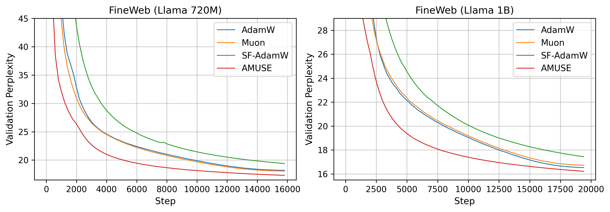
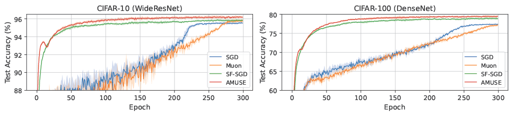
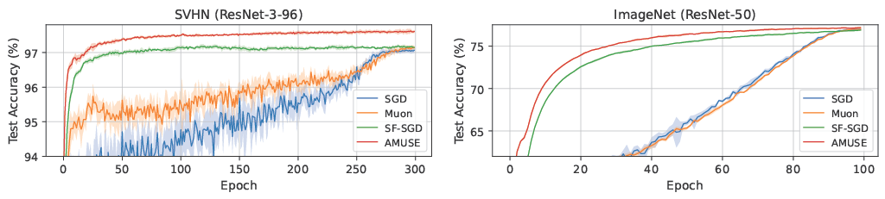

<h1 align="center">AMUSE</h1>

<p align="center">
  <strong>AMUSE: Anytime Muon with Stable Gradient Evaluation</strong>
</p>

<p align="center">
  Jueun Kim* · Baekrok Shin* · Jihun Yun · Beomhan Baek · Minhak Song · Chulhee Yun
</p>

<p align="center">
  <a href="https://arxiv.org/abs/2605.22432"></a>
  <a href="#citation"></a>
  
</p>

## Abstract

- AMUSE combines the fast progress of Muon with the stability of Schedule-Free optimization using a time-varying Schedule-Free momentum.

- From a river-valley perspective, Muon accelerates progress along flat bulk directions but can amplify oscillations along high-curvature dominant directions. AMUSE gradually moves gradient evaluation from the fast Muon trajectory toward a stable averaged trajectory, reducing oscillations while preserving rapid early progress.

- Across vision tasks and language model pretraining, AMUSE improves the performance-iteration Pareto frontier over AdamW, Schedule-Free AdamW, and Muon.

**Full paper abstract**:
> Modern deep learning commonly relies on AdamW with prescribed learning rate schedules, but recent works challenge both components: Schedule-Free optimization removes explicit schedules via iterate averaging, and Muon improves the update geometry by orthogonalizing momentum for matrix parameters. Despite Muon's strong empirical performance, its underlying mechanism remains partially understood.
> We study Muon through the river-valley loss landscape, where useful training progress occurs along a flat, low-curvature bulk subspace, while high-curvature dominant directions form steep valley walls that induce oscillations. We empirically show that while Muon's orthogonalization accelerates river progress by increasing the bulk component, it also amplifies dominant-direction noise, causing oscillatory trajectories.
> Building on this, we propose **Anytime MUon with Stable gradient Evaluation (AMUSE)**, which integrates Muon's rapid bulk progress with the stabilizing effect of Schedule-Free averaging. AMUSE uses a time-varying interpolation coefficient that initially evaluates gradients near the fast Muon sequence for rapid adaptation, then gradually shifts toward the stable averaged sequence to suppress valley-wall oscillations. As a result, AMUSE requires no learning rate schedules and supports anytime training.
> Across vision tasks and large language model pretraining, AMUSE consistently improves the performance-iteration Pareto frontier over (Schedule-Free) AdamW and Muon.


## Repository Structure

```text
amuse/
├── src/lm/       # language model pretraining experiments
├── src/image/    # vision/image experiments
├── src/optim/    # AMUSE and optimizer implementations
├── scripts/      # launch scripts
└── assets/       # figures and result plots
```


## Installation

```bash
conda create -n amuse python=3.10
conda activate amuse
pip install -r requirements.txt
```

## Quick Start

For language model pretraining, run AMUSE on a 124M Llama-style model with:

```bash
bash scripts/lm/124m/amuse.sh
```

Set `YOUR_DATASET_DIR` in the script to the root directory used by the FineWeb-100B loader.

For image classification, run AMUSE on CIFAR-10 with:

```bash
bash scripts/image/cifar10/amuse.sh
```

Other image experiments are available through:

```bash
bash scripts/image/cifar100/amuse.sh
bash scripts/image/svhn/amuse.sh
bash scripts/image/imagenet/amuse.sh
```

For ImageNet, set `YOUR_DATASET_DIR` in the corresponding script. See [`src/lm/README.md`](src/lm/README.md) and [`src/image/README.md`](src/image/README.md) for task-specific optimizer and parameter grouping details.


## Results

### Language Model Pretraining

AMUSE achieves the performance-iteration Pareto frontier in Llama-style pretraining on FineWeb-100B.

<p align="center">
  
</p>


The same trend holds across model scales.

<p align="center">
  
</p>


### Image Classification

AMUSE also performs strongly across standard image classification benchmarks.

<p align="center">
  
</p>


<p align="center">
  
</p>


## Citation

```bibtex
@article{kim2026amuse,
  title={{AMUSE}: Anytime Muon with Stable Gradient Evaluation},
  author={Kim, Jueun and Shin, Baekrok and Yun, Jihun and Baek, Beomhan and Song, Minhak and Yun, Chulhee},
  journal={arXiv preprint arXiv:2605.22432},
  year={2026}
}
```
